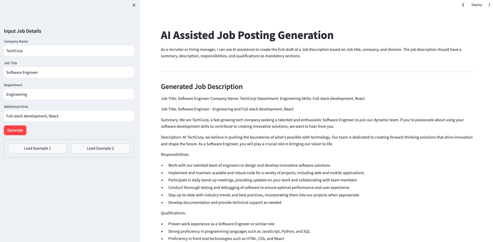

# competency-development-genai

[](https://img.shields.io/badge/license-UPL-green)<!--[](https://sonarcloud.io/dashboard?id=oracle-devrel_competency-development-genai)-->

## Introduction

As a recruiter or hiring manager, you can use AI assistance to create the first draft of a Job Description based on Job title, company, and division. The Gen AI can assist creating a draft job description that includes summary, description, responsibilities, and qualifications. This is a demo application showcasing how you can use OCI Generative AI service to quickly create a working application.

Prerequisites and setup

1. Oracle Cloud account—sign-up
2. Create oci config

### Getting started

Application uses OCI Generative AI Service to create Job Description based on user inputs. The OCI client ```client.py``` creates the client to connect to the OCI Generative AI service.

To install the demo application, follow the steps below:

1. Update the `config.toml` file with location of your oci config file:

  ```toml
  [user]
  userconfig = <you config file location>
  profile = "DEFAULT"
  compartment_id = <Your compartment>
  ```

2. Create a virtual environment:

  ```bash
  python3 -m venv .demo
  ```

3. Activate the virtual environment

  ```bash
  source .demo/bin/activate
  ```

4. Install Python requirements:

  ```bash
  pip install -r requirements.txt
  ```

5. Run the app:

  ```python
  (.demo) %  streamlit run jobposting.py
  ```

This should bring up the application and following message will be displayed in the terminal. You can access the application in your browser.

```bash
  > You can now view your Streamlit app in your browser.

  Local URL: http://localhost:8501
  Network URL: http://10.126.180.172:8501
```



Feel free to experiment with prompt and examples. Enjoy!

## Contributing

<!-- If your project has specific contribution requirements, update the
    CONTRIBUTING.md file to ensure those requirements are clearly explained. -->

This project welcomes contributions from the community. Before submitting a pull
request, please [review our contribution guide](./CONTRIBUTING.md).

## Security

Please consult the [security guide](./SECURITY.md) for our responsible security
vulnerability disclosure process.

## License

Copyright (c) 2024 Oracle and/or its affiliates.

Licensed under the Universal Permissive License (UPL), Version 1.0.

See [LICENSE](LICENSE.txt) for more details.

ORACLE AND ITS AFFILIATES DO NOT PROVIDE ANY WARRANTY WHATSOEVER, EXPRESS OR IMPLIED, FOR ANY SOFTWARE, MATERIAL OR CONTENT OF ANY KIND CONTAINED OR PRODUCED WITHIN THIS REPOSITORY, AND IN PARTICULAR SPECIFICALLY DISCLAIM ANY AND ALL IMPLIED WARRANTIES OF TITLE, NON-INFRINGEMENT, MERCHANTABILITY, AND FITNESS FOR A PARTICULAR PURPOSE.  FURTHERMORE, ORACLE AND ITS AFFILIATES DO NOT REPRESENT THAT ANY CUSTOMARY SECURITY REVIEW HAS BEEN PERFORMED WITH RESPECT TO ANY SOFTWARE, MATERIAL OR CONTENT CONTAINED OR PRODUCED WITHIN THIS REPOSITORY. IN ADDITION, AND WITHOUT LIMITING THE FOREGOING, THIRD PARTIES MAY HAVE POSTED SOFTWARE, MATERIAL OR CONTENT TO THIS REPOSITORY WITHOUT ANY REVIEW. USE AT YOUR OWN RISK.
